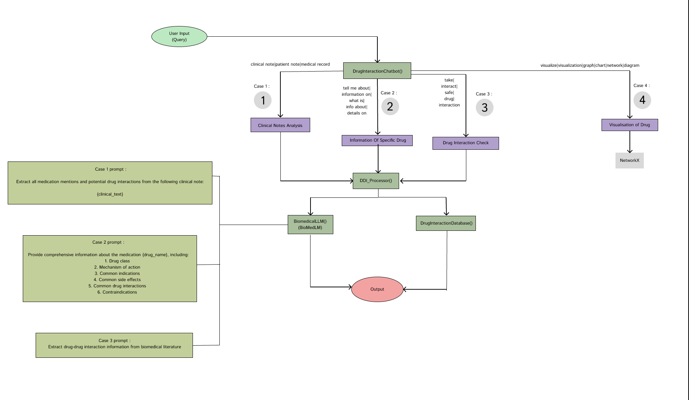

# Drug Interaction Assistant

A Streamlit application that helps users analyze drug interactions, get information about medications, and visualize drug interaction networks. Powered by biomedical language models.

## Features

- **Drug Interaction Analysis**: Check potential interactions between medications
- **Drug Information**: Get detailed information about specific drugs
- **Clinical Note Analysis**: Extract medications and potential interactions from clinical notes
- **Visualization**: Generate network visualizations of drug interactions

## How to Use

1. **Chat with the Assistant**: Ask questions about drug interactions, drug information, or request analysis of clinical notes
2. **Drug Information**: Search for a specific drug to get detailed information
3. **Clinical Note Analysis**: Enter clinical notes to extract medications and potential interactions

## Example Questions

- "Can I take aspirin and warfarin together?"
- "Tell me about metformin"
- "Analyze this clinical note: Patient is taking..."
- "Show me a visualization for warfarin"

## Technical Details

This application uses:
- Streamlit for the web interface
- PyTorch and Transformers for the biomedical language model
- NetworkX for graph visualization
- Matplotlib for plotting
## Summary

## Disclaimer

This information is for educational purposes only. Always consult a healthcare professional for medical advice. 